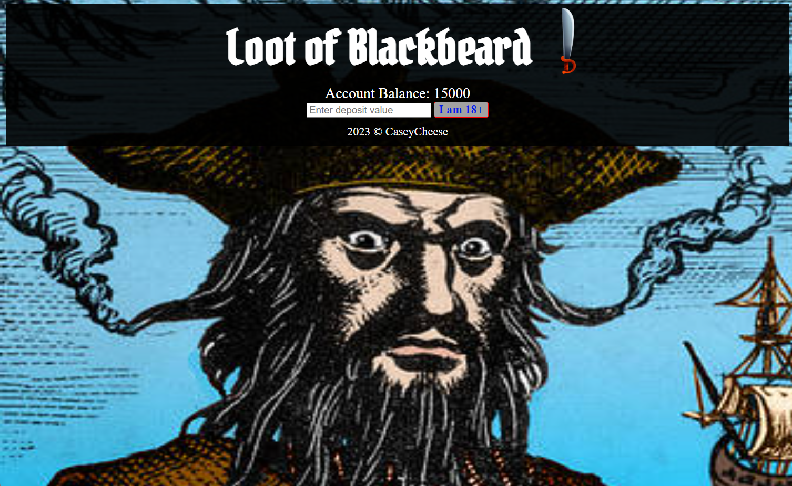
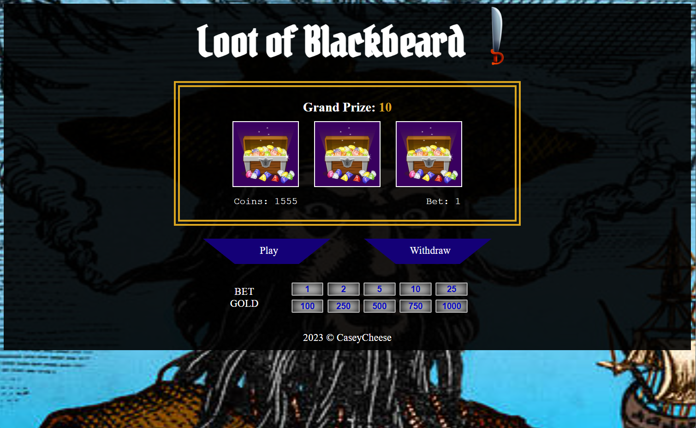
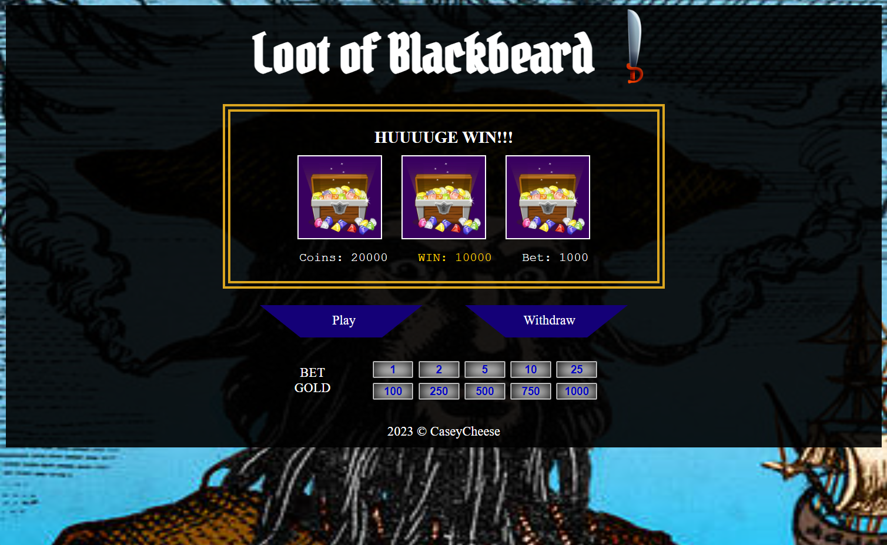
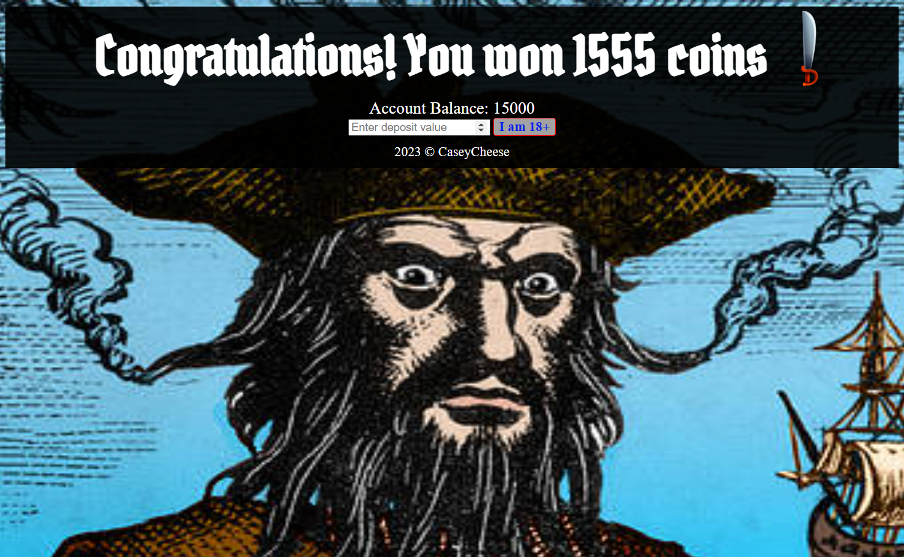
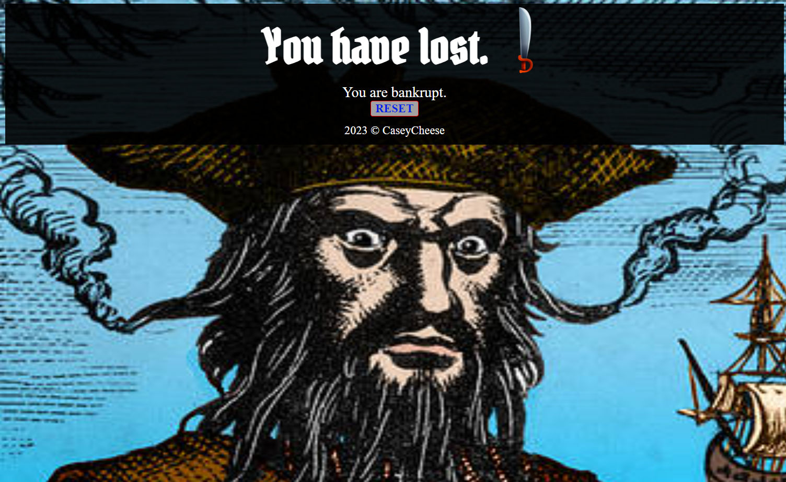

## Game Title: Loot of Blackbeard
This is my first project I'm adding to GitHub! I decided to create a pirate-themed slot machine as I've found myself to be intrigued by how they are able to capture people's attention so well. Learning the odds behind winning in these machines has turned me off from using them in real life xD.

### Description of the game
- 'Loot of Blackbeard' is a pirate-themed slot machine based game running in the web browser.
- You can deposit gold coins to play with the hopes of winning the grand prize.
- You can bet different amount of gold coins at once as a multiplier.
- You can withdraw your gold coins at any time which will conclude the game.
- If you run out of gold coins, you will go bankrupt.
- If you withdraw before your bank account reaches 0 gold coins, you win!

### Wireframe

### Screenshots

### Technologies Used
- HTML
- CSS
- JavaScript

### Getting Started
[Click here to play!](https://caseycheese.github.io/Pirate-Slots/)

#### How To Play
1. Deposit gold coins into the slot machine,
2. Click the amount of gold coins you would like to bet (optional),
3. Click the play button to spin the slot,
4. Click the withdraw button to end.

### Next Steps
- Add age verification
- Add more slots
- Add different odds for different slot images
- Make randomness of the slots unable to be predicted (since Math.random() is only pseudo-random.)

### Assets used
- [Slot Inspiration](https://gamble-usa.com/slots/best-slots-on-stake-us/)
- [Treasure Chest](https://depositphotos.com/stock-photos/treasure-chest.html)
- [Pirate canon](https://www.freepik.com/premium-vector/canon-pirate-gradient-illustration_5963899.htm)
- [Blackbeard](http://wzzkid94.deviantart.com/art/blackbeard-210254934)
- [Pirate sword](https://pngtree.com/free-png-vectors/pirate-sword)
- [Pirata One Font](https://fonts.google.com/specimen/Pirata+One)
